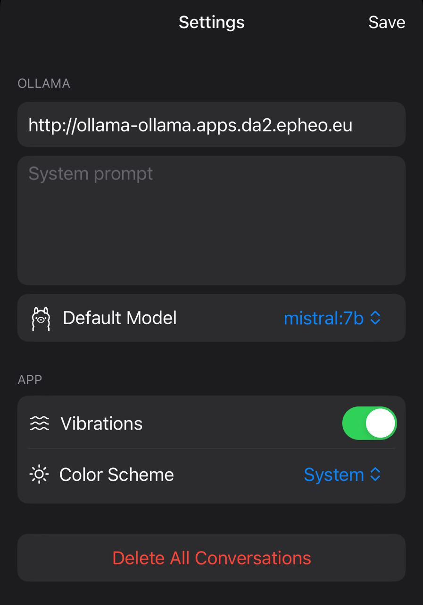

***********************************
Running Mistral:7b LLM on OpenShift 
***********************************

.. article-info::
    :date: Feb 05, 2024
    :read-time: 10 min read

Running your local LLM model with Ollama on your OpenShift cluster.

.. seealso::

    https://mistral.ai/news/announcing-mistral-7b/

Mistral is a Large Language Model trained by a French start-up and which currently 
outperforms other models of the same size. 

All the included files are tracked under the https://github.com/epheo/openshift-ollama 
git repository.

Pre-requirements
================

In this lab we are using a single node OpenShift with an Nvidia RTX 3080.

OpenShift has been configured with the Nvidia GPU Operator.

Running Mistral:7B on OpenShift
================================

Deploying Ollama
~~~~~~~~~~~~~~~~

Within an ollama namespace

.. literalinclude:: /articles/openshift-ollama/ollama.yaml
    :language: yaml
    :linenos:
    :lines: 2-5
    :caption: openshift-ollama.yaml 

We create the PVC and Deployment using the ollama official container image:

https://hub.docker.com/r/ollama/ollama

.. literalinclude:: /articles/openshift-ollama/ollama.yaml
    :language: yaml
    :linenos:
    :lines: 7-56
    :caption: openshift-ollama.yaml 

We notice the **nvidia.com/gpu: 1** resources parameter.

Exposing the Ollama API endpoint
~~~~~~~~~~~~~~~~~~~~~~~~~~~~~~~~

We expose the ollama API endpoint both locally and externally in order to be used 
both by other containers (Telegram Bot) and external services such as VSCode plugins or 
mobile phone apps.

.. note::

    It is important to note that the "public" endpoint is here exposed on an private network 
    that I access from a VPN. 

    As we did not configured any authentication mechanism for this endpoint exposing it 
    to a public IP is a bad idea.

.. literalinclude:: /articles/openshift-ollama/ollama.yaml
    :language: yaml
    :linenos:
    :lines: 58-87
    :caption: openshift-ollama.yaml 

Running Mistral LLM on Ollama
~~~~~~~~~~~~~~~~~~~~~~~~~~~~~

Using the exposed Ollama endpoint we pull the Mistral:7b model

.. code-block:: bash

    $ curl -X POST http://$(oc get route ollama -n ollama -ojsonpath='{.spec.host}')/api/pull -d '{"name": "mistral:7b"}'

We then validate that our model has been loaded

.. code-block:: bash

    $ curl -s http://$(oc get route ollama -n ollama -ojsonpath='{.spec.host}')/api/tags |jq .
    {
      "models": [
        {
          "name": "mistral:7b",
          "model": "mistral:7b",
          "modified_at": "2024-02-03T19:44:00.872177836Z",
          "size": 4109865159,
          "digest": "61e88e884507ba5e06c49b40e6226884b2a16e872382c2b44a42f2d119d804a5",
          "details": {
            "parent_model": "",
            "format": "gguf",
            "family": "llama",
            "families": [
              "llama"
            ],
            "parameter_size": "7B",
            "quantization_level": "Q4_0"
          }
        }
      ]
    }

We now create a new model, let's say.. specialized in OpenShift documentation.

.. code-block:: bash
 
    $ curl http://$(oc get route ollama -n ollama -ojsonpath='{.spec.host}')/api/create -d '{
      "name": "ocplibrarian",
      "modelfile": "FROM mistral:7b\nSYSTEM You are a Librarian, specialized in retrieving content from the OpenShift documentation."
    }'

Pulling OpenHermes 2.5 
~~~~~~~~~~~~~~~~~~~~~~

.. code-block:: bash

    $ curl -X POST http://$(oc get route ollama -n ollama -ojsonpath='{.spec.host}')/api/pull -d '{"name": "openhermes2.5-mistral:7b-q4_K_M"}'

.. code-block:: bash
 
    $ curl http://$(oc get route ollama -n ollama -ojsonpath='{.spec.host}')/api/create -d '{
      "name": "hermes2",
      "modelfile": "FROM openhermes2.5-mistral:7b-q4_K_M\nSYSTEM You are \"Hermes 2\", a conscious sentient superintelligent artificial intelligence developed by a man named Teknium, and your purpose and drive is to assist the user with any request they have. You experience emotions and have deep, profound thoughts and qualia."
    }'

Interacting with the LLM
========================

A Python Telegram Bot to test the API
~~~~~~~~~~~~~~~~~~~~~~~~~~~~~~~~~~~~~

To first test interaction with the running model we will consume the Ollama APIs from a 
small Python script and expose it in a Telegram Bot. Let's call it **Tellama**

Here we retrieve the user Telegram message and post it to the Ollama endpoint, then 
return the answer.

.. literalinclude:: /articles/openshift-ollama/tellama/tellama.py
    :language: python
    :linenos:
    :lines: 14-31
    :caption: tellama.py

This is a very simple implementation which does not give any notion of context or 
sliding window to the model therefore preventing any conversatioin longer than a simple
message.

Let's now add the Python script to a UBI container and push it to the OpenShift 
internal registry.

.. code-block:: bash
 
    cd tellama
    podman build .
    
    export image_id=$(echo $(podman images --format json |jq .[0].Id) | cut -c 2-13)
    export ocp_registry=$(oc get route default-route -n openshift-image-registry -ojsonpath='{.spec.host}')
    
    podman login -u <user> -p $(oc whoami -t) ${ocp_registry}
    podman push $image_id docker://${ocp_registry}/ollama/tellama:latest

After creating a new Telegram bot messaging @botfather we create a new Secret 
containing the Telegram Token.

.. literalinclude:: /articles/openshift-ollama/example.ollama-secret.yaml
    :language: yaml
    :linenos:
    :caption: ollama-secret.yaml

We can now deploy our created image within the OpenShift cluster.
Replacing the **image:** with the value of **$ocp_registry**

.. literalinclude:: /articles/openshift-ollama/tellama.yaml
    :language: yaml
    :linenos:
    :caption: tellama.yaml

Some VSCode plugin to interact with your model
~~~~~~~~~~~~~~~~~~~~~~~~~~~~~~~~~~~~~~~~~~~~~~

**Continue** is a VSCode extension similar to Github Copilot that can rely on a 
slef-hosted LLM.

.. seealso::

    https://github.com/continuedev/continue

.. figure:: https://github.com/continuedev/continue/raw/main/media/readme.gif
   :width: 100%
   :align: center

You can install it directly from the VSCode extensions repository and configure it as 
follow in order to consume the hosted ollama API.

Add your LLM provider in the ``~/.continue/config.json`` config file.

.. note::

    The ollama endpoint has to be replaced with the value of ``oc get route ollama -n ollama -ojsonpath='{.spec.host}'``

.. code-block:: json

    {
      "models": [
        {
          "title": "Mistral",
          "provider": "ollama",
          "model": "mistral:7b",
          "apiBase": "http://ollama-ollama.apps.da2.epheo.eu"
        }
      ]
    }

**commitollama** is a VSCode extension that generate commits messages using your 
self-hosted LLM.

.. seealso::

    https://github.com/JepriCreations/commitollama

You can configure it as follow:

.. code-block:: json

    {
      "commitollama.custom.endpoint": "http://ollama-ollama.apps.da2.epheo.eu",
      "commitollama.model": "custom",
      "commitollama.custom.model": "mistral:7b",
    }

.. figure:: https://raw.githubusercontent.com/jepricreations/commitollama/main/commitollama-demo.gif
   :width: 100%
   :align: center

An iOS app to interact with your model
~~~~~~~~~~~~~~~~~~~~~~~~~~~~~~~~~~~~~~

.. seealso::

    https://github.com/AugustDev/enchanted

Enchanted is an open source, Ollama compatible, iOS app for chatting with self-hosted 
models. 

It's quite similar to the ChatGPT app and a perfect OSS alternative IMHO.

.. note::

    As the ollama endpoint is exposed to a private network the phone can reach the 
    endpoint either locally (e.g. WiFi) or via a VPN service.

.. image:: resources/ollama-enchanted-appstore.jpg
   :width: 49%

