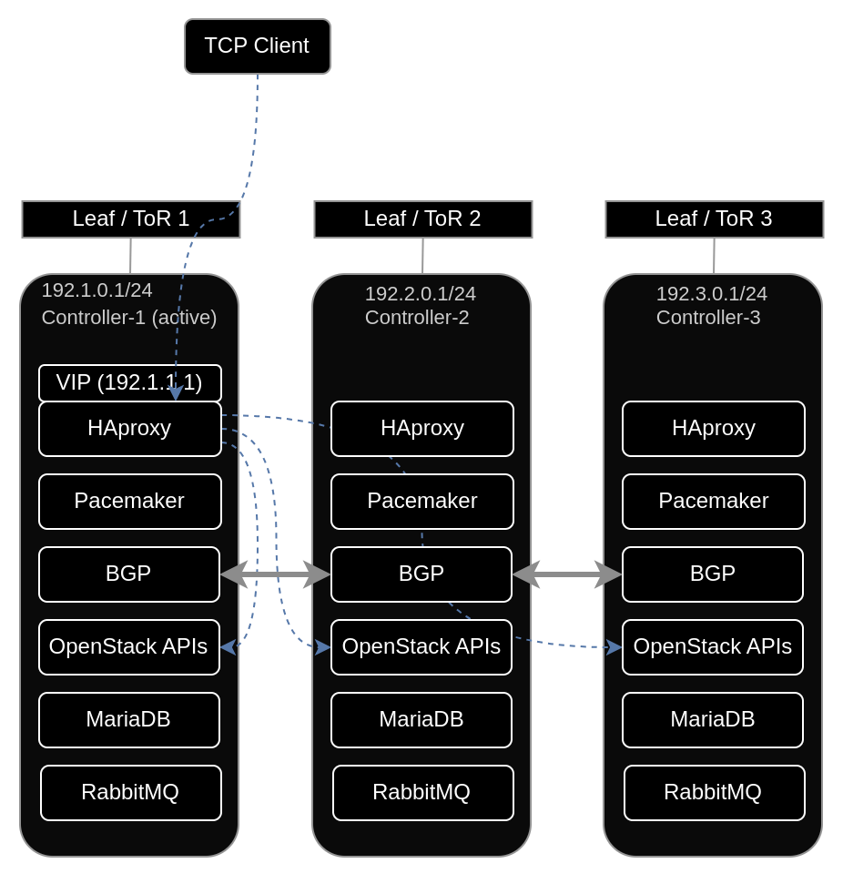
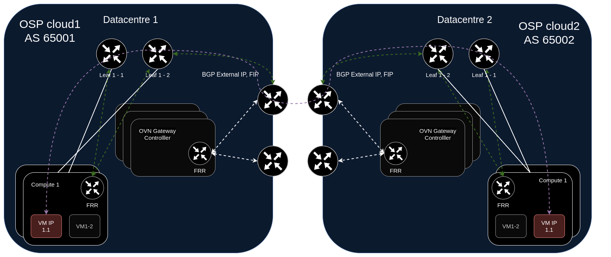

Case Studies and Implementation Examples
=============================================

This section covers practical implementation scenarios for BGP in Red Hat OpenStack Platform.

Scenario 1: Control Plane High Availability
-------------------------------------------

BGP enables highly available OpenStack API endpoints without traditional L2 spanning across sites.

**Technical implementation:**
  
* Controllers deployed across multiple racks in separate L3 segments
* Each rack's Top-of-Rack (ToR) switch acts as a BGP peer
* Control plane services use a VIP advertised via BGP
* FRR configuration example:
  
  .. code-block:: text
  
      # FRR configuration on OpenStack Controller
      router bgp 64999
        bgp router-id 172.30.1.1
        neighbor 172.30.1.254 remote-as 65000
        address-family ipv4 unicast
          network 192.1.1.1/32
        exit-address-family
  
* OVN BGP agent monitors control plane events
* Pacemaker influences BGP route advertisements based on controller health
* Fast convergence enables rapid failover



Scenario 2: Multi-Cloud Connectivity
------------------------------------

BGP enables secure connectivity between multiple OpenStack clouds and external networks.
  
**Technical implementation:**
  
* Each OpenStack cloud uses a unique ASN
* Border nodes run FRR with eBGP peering to external routers
* FRR configuration example:
  
  .. code-block:: text

     # FRR configuration on border node
     router bgp 64999
       bgp router-id 10.0.0.1
       neighbor 203.0.113.1 remote-as 65001  # External peer
       address-family ipv4 unicast
         network 172.16.0.0/16  # Tenant network range
         redistribute connected
       exit-address-family
  
* IP rules configured by OVN BGP agent:
  
  .. code-block:: bash

      # IP rules example
      $ ip rule
      0:      from all lookup local
      1000:   from all lookup [l3mdev-table]
      32000:  from all to 172.16.0.0/16 lookup br-ex  # tenant networks
      32766:  from all lookup main
      32767:  from all lookup default



Scenario 3: ECMP Load Balancing and Redundancy
----------------------------------------------

FRR implements Equal-Cost Multi-Path (ECMP) routing for load balancing and redundancy.
  
**Technical implementation:**
  
* ECMP configuration in FRR:
  
  .. code-block:: text

      # ECMP configuration
      router bgp 64999
        maximum-paths 8
        maximum-paths ibgp 8
  
* BFD for fast failure detection:
  
  .. code-block:: text

     # BFD configuration
     router bgp 64999
       neighbor 192.0.2.1 bfd
       neighbor 192.0.2.2 bfd
  
* Traffic auto-rerouted to available paths during failures
* OVN BGP agent configuration for traffic flow:
  
  .. code-block:: bash

     # BGP traffic redirection components:
     - Dummy interface (bgp-nic) added to VRF (bgp_vrf)
     - Routes added to OVS provider bridge table
     - ARP/NDP entries configured for OVN router gateway ports
     - OVS flows for traffic redirection

Scenario 4: Dynamic Route Advertisement
---------------------------------------

BGP simplifies scaling by dynamically advertising routes as new resources are provisioned.
  
**Implementation workflow:**
  
1. New VM with IP 172.16.5.10 created on Compute node
2. OVN BGP agent detects VM in southbound database
3. Agent adds IP to dummy interface:
   ```$ ip addr add 172.16.5.10/32 dev bgp-nic```
4. FRR's Zebra daemon detects IP and advertises via BGP
5. Agent configures traffic redirection:
   ```$ ovs-ofctl add-flow br-ex "priority=900,ip,in_port=patch-provnet-1,actions=mod_dl_dst:<bridge_mac>,NORMAL"```
6. External BGP peers receive route and can reach VM

For floating IPs, similar automation occurs when they're associated with instances, eliminating manual route configuration as the environment scales.

Scenario 5: Distributed L2 Provider VLANs
-----------------------------------------

BGP allows distributing L2 provider VLANs and floating IP subnets across L3 boundaries.

**Technical implementation:**

* Provider VLANs distributed across racks without spanning VLANs (for non-overlapping CIDRs)
* Configuration allows separation of provider networks across physical boundaries
* Traffic routed between segments using BGP-advertised routes instead of traditional L2 connectivity
* Simplified network design with reduced broadcast domains

Scenario 6: Tenant Network Exposure
-----------------------------------

OpenStack can optionally expose tenant networks via BGP using a special configuration flag.

**Technical implementation:**

* Set the `expose_tenant_networks` flag to True in OVN BGP agent configuration:

  .. code-block:: ini

      [DEFAULT]
      expose_tenant_networks = True
  
* With this setting, tenant network IPs are advertised just like provider networks
* This feature requires non-overlapping CIDRs across tenants
* Tenant VMs become directly reachable from external networks without floating IPs 
  